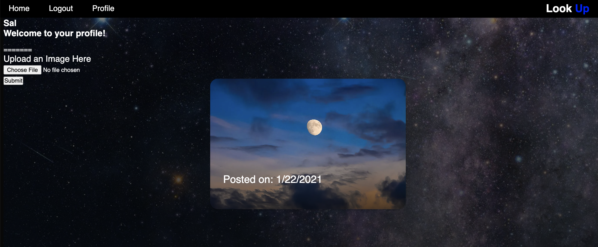
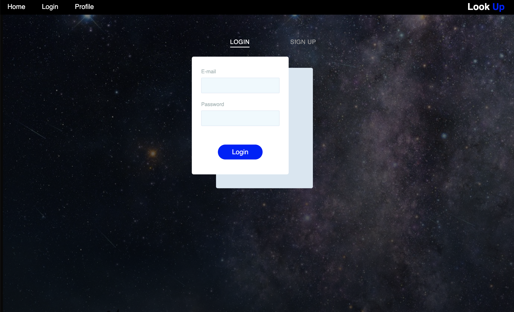

# Look Up

## Table of Contents

- [Description](#description)
  - [Screenshot](#screenshot)
  - [Links](#links)
  - [Built with](#built-with)
  - [Continued development](#continued-development)
- [Authors](#authors)

## Description
Look Up is a destressing social media app where users can create their own profile to post post beautiful pictures of the sky. For example, you may be passing a beautiful bird in the sky or a beautiful sunset with no one to share it with and Look Up is the perfect application to uplift your spirit. Our only rule is, your camera MUST be pointed to the sky.

## Usage
From the homepage, you can navigate to the login page to make an account. If you are not logged in and click profile in the nav bar, you will be redirected to the signup/login page. To create an account, type in your preferred username, your email and create a password that is longer than 8 characters. When you login, you were be redirected to your profile page that will show all the pictures you have posted. When you navigate to the home page, there you will see all the posts from registered users in the feed. Users can log out when they are done. They can view the home page and posts without signing it, however if they want to post another image, the users might login back into their account.

### Screenshot

### Deloyed Link
- Heroku Link: [https://look-up-project-2.herokuapp.com/]

## Built with
* Cloudinary 
* Express
* Sequelize
* Node.js
* Javascript
* Multer
* Nodemon

## Continued Development
We are actively considering the following for future development:

* Users can delete their own post
* Users can upload more than one picture at a time
* Users can add captions to their photos 
* Other users can like/love/share a photo 
* Search button to look for other users’ posts and profiles
* Location services - so that users can look at sky images from different parts of the world
* Users that create a post will be added to the feed and filtered by posted by date 

## Authors
  Betty Lu, Kristina Dukes, Amal Engulatov, and Jordan Dukes